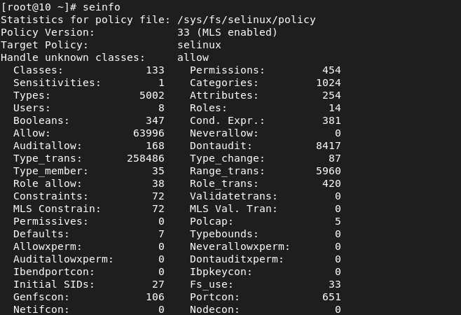

---
# Front matter
lang: ru-RU
title: Защита лабораторной работы №6. Мандатное разграничение прав в Linux 
author: "Бурдина Ксения Павловна"
group: NFIbd-01-19
institute: RUDN University, Moscow, Russian Federation
date: 2022 Oct 11th

# Formatting
toc: false
slide_level: 2
header-includes: 
 - \metroset{progressbar=frametitle,sectionpage=progressbar,numbering=fraction}
 - '\makeatletter'
 - '\beamer@ignorenonframefalse'
 - '\makeatother'
aspectratio: 43
section-titles: true
theme: metropolis

---

# Результат выполнения лабораторной работы №6

# Цель выполнения лабораторной работы 

## Цель выполнения лабораторной работы

Развитие навыков администрирования ОС Linux, получение практического знакомства с технологией SELinux, а также проверка работы SELinux на практике совместно с веб-сервером Apache.

# Результат выполнения лабораторной работы

## Результат выполнения лабораторной работы

Настройка каталога httpd для работы: проверка наличия необходимых файлов, настройка фильтров:

{width=90%}

## Результат выполнения лабораторной работы

Проверка, что SELinux работает в режиме enforcing политики targeted:

{width=90%}

## Результат выполнения лабораторной работы

Проверка работы веб-сервера:

{width=80%}

## Результат выполнения лабораторной работы

Нахождение веб-сервера Apache в списке процессов:

{width=85%}

## Результат выполнения лабораторной работы

Просмотр текущего состояния переключателей SELinux для Apache:

{width=75%}

## Результат выполнения лабораторной работы

Посмотр статистики по политике с помощью команды seinfo:

{width=75%}

## Результат выполнения лабораторной работы

Определение типа файлов и поддиректорий, находящихся в директории /var/www:

## Результат выполнения лабораторной работы

Создание файла test.html:

{width=90%}

## Результат выполнения лабораторной работы

Проверка контекста созданного файла:

{width=90%}

Просмотр контекста, присваиваемого по умолчанию вновь созданным файлам в директории /var/www/html:

{width=90%}

## Результат выполнения лабораторной работы

Обращение к файлу через веб-браузер по адресу http://127.0.0.1/test.html:

{width=90%}

## Результат выполнения лабораторной работы

Изменение контекста файла test.html с httpd_sys_content_t на samba_share_t, проверка правильность изменения контекста:

## Результат выполнения лабораторной работы

Попытка получения доступа к измененному файлу через веб-сервер:

{width=90%}

## Результат выполнения лабораторной работы

Просмотр log-файлов веб-сервера Apache и системного log-файла:

{width=70%}
{width=70%}

## Результат выполнения лабораторной работы

Запуск веб-сервера Apache на прослушивание ТСР-порта:

При перезапуске сервера после смены строки с прослушиванием, он не будет работать, поскольку сервер настроен на обределенную частоту прослушки и не сможет быть подключен с другими параметрами.

## Результат выполнения лабораторной работы

Анализ log-файлов:

## Результат выполнения лабораторной работы

Проверка списка команд, вводимых портом:

## Результат выполнения лабораторной работы

Возвращение контекста httpd_sys_cоntent__t к файлу test.html:

{width=90%}

Удаление привязки http_port_t к 81 порту и удаление файла test.html:

{width=90%}

{width=75%}

# Выводы

## Выводы

1. Развили навыки администрирования ОС Linux;

2. Получили практическое знакомство с технологией SELinux;

3. Проверили работу SELinux на практике совместно с веб-сервером Apache.
