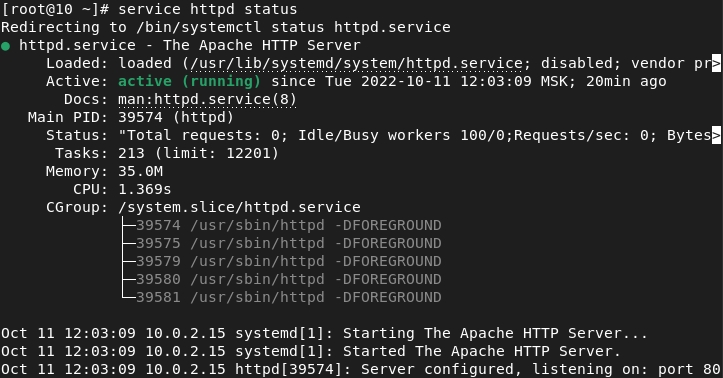
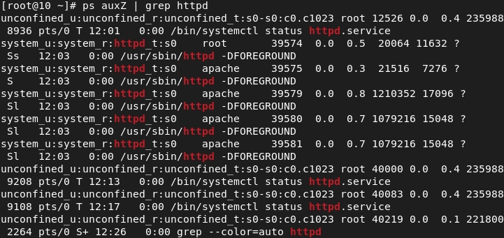
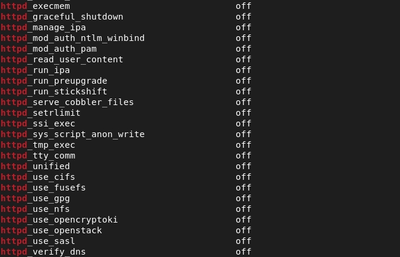
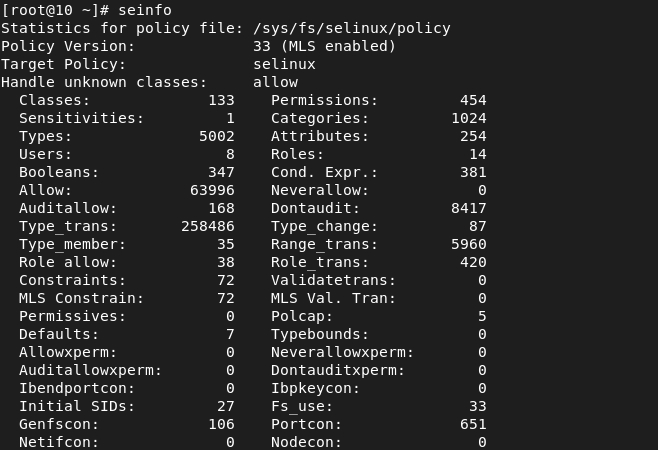
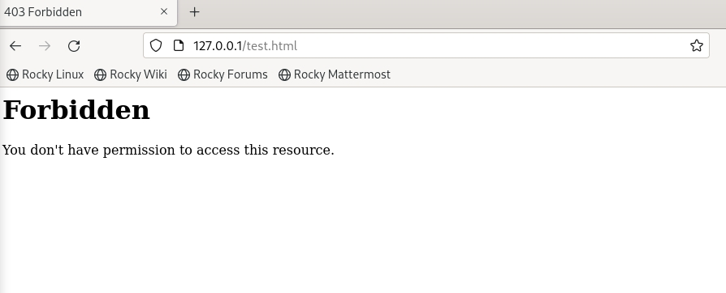
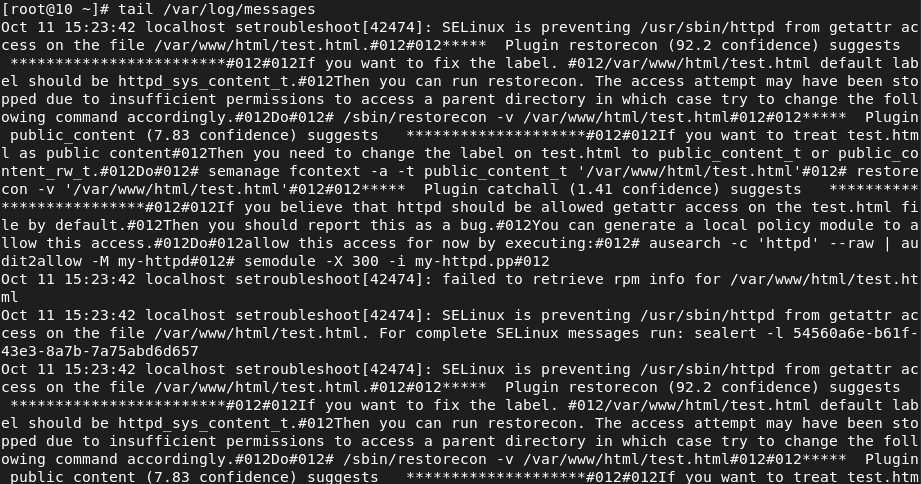
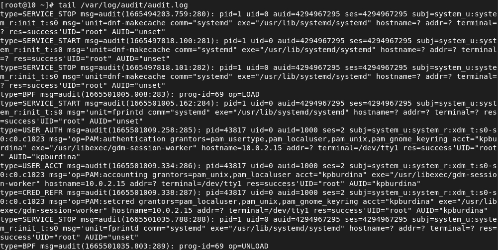

---
# Front matter
title: "Отчет по лабораторной работе №6"
subtitle: "Мандатное разграничение прав в Linux"
author: "Бурдина Ксения Павловна"
group: NFIbd-01-19
institute: RUDN University, Moscow, Russian Federation
date: 2022 Oct 11th

# Generic otions
lang: ru-RU
toc-title: "Содержание"

# Pdf output format
toc: true # Table of contents
toc_depth: 2
lof: true # List of figures
fontsize: 12pt
linestretch: 1.5
papersize: a4
documentclass: scrreprt
### Fonts
mainfont: PT Serif
romanfont: PT Serif
sansfont: PT Sans
monofont: PT Mono
mainfontoptions: Ligatures=TeX
romanfontoptions: Ligatures=TeX
sansfontoptions: Ligatures=TeX,Scale=MatchLowercase
monofontoptions: Scale=MatchLowercase,Scale=0.9
## Biblatex
biblatex: true
biblio-style: "gost-numeric"
biblatexoptions:
  - parentracker=true
  - backend=biber
  - hyperref=auto
  - language=auto
  - autolang=other*
  - citestyle=gost-numeric
## Misc options
indent: true
header-includes:
  - \linepenalty=10 # the penalty added to the badness of each line within a paragraph (no associated penalty node) Increasing the value makes tex try to have fewer lines in the paragraph.
  - \interlinepenalty=0 # value of the penalty (node) added after each line of a paragraph.
  - \hyphenpenalty=50 # the penalty for line breaking at an automatically inserted hyphen
  - \exhyphenpenalty=50 # the penalty for line breaking at an explicit hyphen
  - \binoppenalty=700 # the penalty for breaking a line at a binary operator
  - \relpenalty=500 # the penalty for breaking a line at a relation
  - \clubpenalty=150 # extra penalty for breaking after first line of a paragraph
  - \widowpenalty=150 # extra penalty for breaking before last line of a paragraph
  - \displaywidowpenalty=50 # extra penalty for breaking before last line before a display math
  - \brokenpenalty=100 # extra penalty for page breaking after a hyphenated line
  - \predisplaypenalty=10000 # penalty for breaking before a display
  - \postdisplaypenalty=0 # penalty for breaking after a display
  - \floatingpenalty = 20000 # penalty for splitting an insertion (can only be split footnote in standard LaTeX)
  - \raggedbottom # or \flushbottom
  - \usepackage{float} # keep figures where there are in the text
  - \floatplacement{figure}{H} # keep figures where there are in the text
---

# Цель работы

Целью данной работы является развитие навыков администрирования ОС Linux, получение практического знакомства с технологией SELinux, а также проверка работы SELinux на практике совместно с веб-сервером Apache.

# Теоретическое введение

При подготовке стенда нам необходима для работы политика targeted и режим enforcing, которые используются в данном дистрибутиве по умолчанию, т.е. каких-то специальных настроек не требуется. При этом пользователю следует убедиться, что политика и режим включены, особенно когда работа будет проводиться повторно и велика вероятность изменений при предыдущем использовании системы.

При необходимости администратор должен разбираться в работе SELinux и уметь как исправить конфигурационный файл /etc/selinux/config, так и проверить используемый режим и политику. Нам необходимо установить веб-сервер Apache. Причем следует учитывать, что при установке системы в конфигурации «рабочая станция» указанный пакет не ставится.

Перед началом работы в конфигурационном файле /etc/httpd/httpd.conf необходимо задать параметр ServerName, чтобы при запуске веб-сервера не выдавались лишние сообщения об ошибках, не относящихся к лабораторной работе. Также необходимо проследить, чтобы пакетный фильтр был отключён или в своей рабочей конфигурации позволял подключаться к 80-у и 81-у портам протокола tcp [[1]](https://esystem.rudn.ru/pluginfile.php/1651889/mod_resource/content/2/005-lab_discret_sticky.pdf).

Выполним все действия для подготовки к работе. Установим httpd для работы, после чего проверим наличие необходимых файлов в каталоге и настроим фильтры. Контрольные команды для дальнейшей работы:

# Ход выполнения лабораторной работы

1. Войдем в систему с полученными учётными данными и убедимся, что SELinux работает в режиме enforcing политики targeted:

Видим, что у нас действительно все работает верно.

2. Обратимся с помощью браузера к веб-серверу, запущенному на нашем компьютере, и убедимся, что последний работает:

3. Найдем веб-сервер Apache в списке процессов, определим его контекст безопасности:

Контекстом безопасности будет system_u:system_r.

4. Посмотрим текущее состояние переключателей SELinux для Apache:

Обратим внимание на то, что многие из них находятся в положении "off".

5. Посмотрим статистику по политике с помощью команды seinfo и определим множество пользователей, ролей и типов:

Видим, что у нас имеется 8 пользователей, 5002 типов и 14 ролей.

6. Определим тип файлов и поддиректорий, находящихся в директории /var/www:

Можем увидеть контекст файлов: system_u, object_r, httpd_sys_content_t/httpd_sys_script_exec_t.

7. Определим тип файлов, находящихся в директории /var/www/html:

Видим, что у нас в данной директории отсутствуют какие-либо файлы.

8. Определяя круг пользователей, которым разрешено создание файлов в данной директории, можно сказать, что создание файлов разрешено всем пользователям.

9. Создадим от имени суперпользователя (так как в дистрибутиве после установки только ему разрешена запись в директорию) html-файл /var/www/html/test.html и запишем в него содержание:

10. Проверим контекст созданного нами файла:

Контекст, присваиваемый по умолчанию вновь созданным файлам в директории /var/www/html, выглядит следующим образом:

Всем создаваемым файлам присваивается контекст: unconfined_u:object_r:httpd_sys_content_t:s0.

11. Обратимся к файлу через веб-браузер, введя в браузере адрес http://127.0.0.1/test.html:

Видим, что наш файл был успешно передан на сервер, поскольку на открывшейся странице отобразился текст нашего файла.

12. Изучим справку по httpd_selinux:

К сожалению, нам невозможно изучить справку, однако посмотреть, какие контексты файлов определены для httpd, мы можем, и они аналогичны тем, что отобразились при просмотре файла test.html.

13. Изменим контекст файла /var/www/html/test.html с httpd_sys_content_t на любой другой, к которому процесс httpd не должен иметь доступа, например, на samba_share_t, после чего проверим правильность изменения контекста:

14. Попробуем ещё раз получить доступ к файлу через веб-сервер, введя в браузере адрес http://127.0.0.1/test.html. На этот раз мы получим следующее сообщение об ошибке:

15. Проанализируем ситуацию. Наш файл не был открыт, поскольку на сервер загружены данные по контексту те, которые назначаются всем файлам по умолчанию. Поэтому при попытке перейти на сайт с измененными данными, мы получим отказ в выполнении действия. 

Но несмотря на это, права доступа позволяют читать файл любому пользователю:

Теперь посмотрим log-файлы веб-сервера Apache, после чего посмотрим системный log-файл:

Видим, что в системе есть запущенные процессы setroubleshootd и audtd, поэтому можно увидеть ошибки, аналогичные указанным выше в файле.

16. Теперь попробуем запустить веб-сервер Apache на прослушивание ТСР-порта. Откроем файл на просмотр:

Однако не сможем изменить данные, поскольку информация из файла нам не была доступна.

17. Если после смены строки с прослушиванием выполнить перезапуск сервера, то он не будет работать, поскольку сервер настроен на обределенную частоту прослушки и не сможет быть подключен с другими параметрами.

18. Проанализируем log-файлы:

После чего посмотрим еще некоторые файлы, однако в силу невозможности работы при текущих критериях, можем понять, что записи не появились и в одном из файлов.

19. Выполним конанду "semanage port" для проверки списка команд, вводимых портом:

Видим, что порт 81 присутстсвует в нашем списке.

20. При попытке запустить веб-сервер Apache ещё раз, все стало работать. То есть на данный момент все добавлено и загружено для возможности пользоваться доступом к файлу.

21. Вернем контекст httpd_sys_cоntent__t к файлу /var/www/html/ test.html:

При попытке получить доступ к исходному файлу, мы снова видим в окне слово test. 

22. Вернем обратно конфигурационный файл Apache, исправив Listen 80.

23. Удалим привязку http_port_t к 81 порту:

24. Удалим файл /var/www/html/test.html для завершения полной работы:

# Выводы

В ходе работы мы развили навыки администрирования ОС Linux; получили практическое знакомство с технологией SELinux; проверили работу SELinux на практике совместно с веб-сервером Apache.

# Список литературы

1. Методические материалы курса [[1]](https://esystem.rudn.ru/pluginfile.php/1651891/mod_resource/content/2/006-lab_selinux.pdf)
